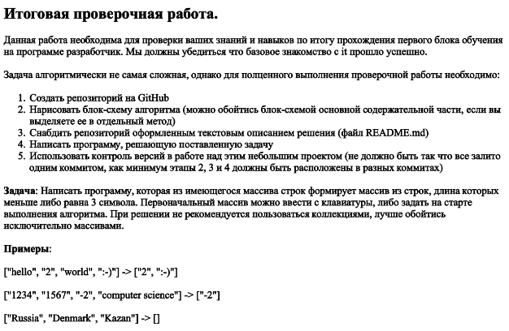
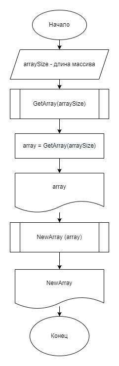

# GB_PracticWork_Module1
## Контрольная работа по итогам обучения первой четверти на курсе "Разработчик" от GeekBrains

# Задание:

# Решение:

1. Пользователь вводит количество элементов массива - **arraySize**;
2. На основании введенного пользователем значения, создаем массив **array** длиной **arraySize**;
3. Создаем Метод **GetArray**, который будет заполнять массив **array** на основании введенных пользователем значений;
4. Выводим на экран получившийся массив **array**;
5. Создаем Метод **NewArray**, который находит количество элементов, длиной меньше или равных 3-м символам. На основании данного количество элементов создается массов, куда перезаписываются элементы, длиной меньше или равных 3-м символам;
6. Выводим результаты метода **NewArray** на экран.

